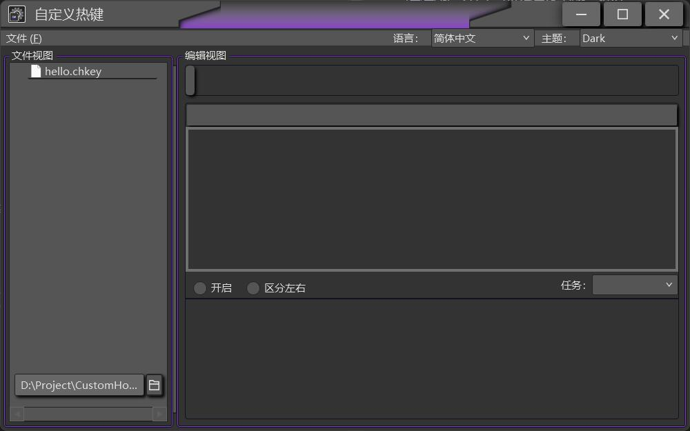
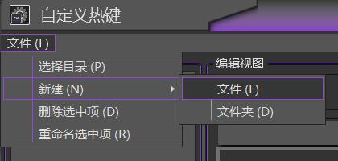
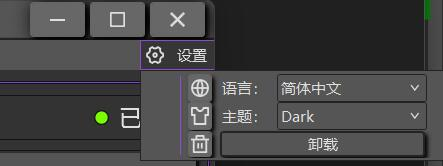
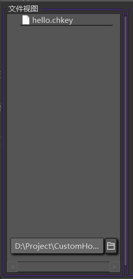
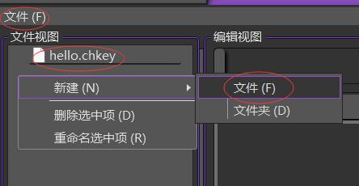
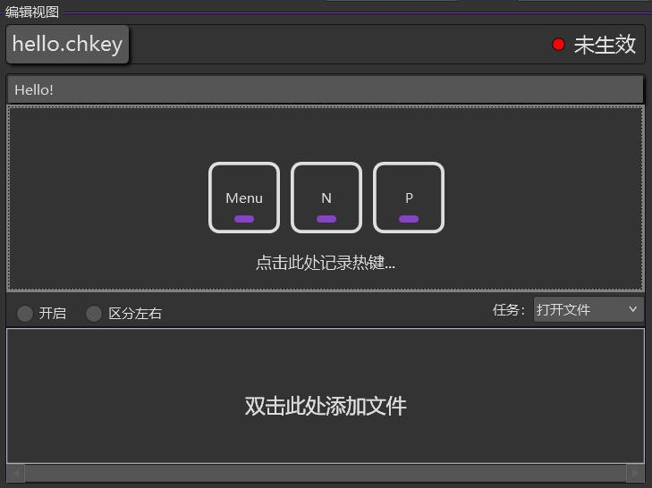
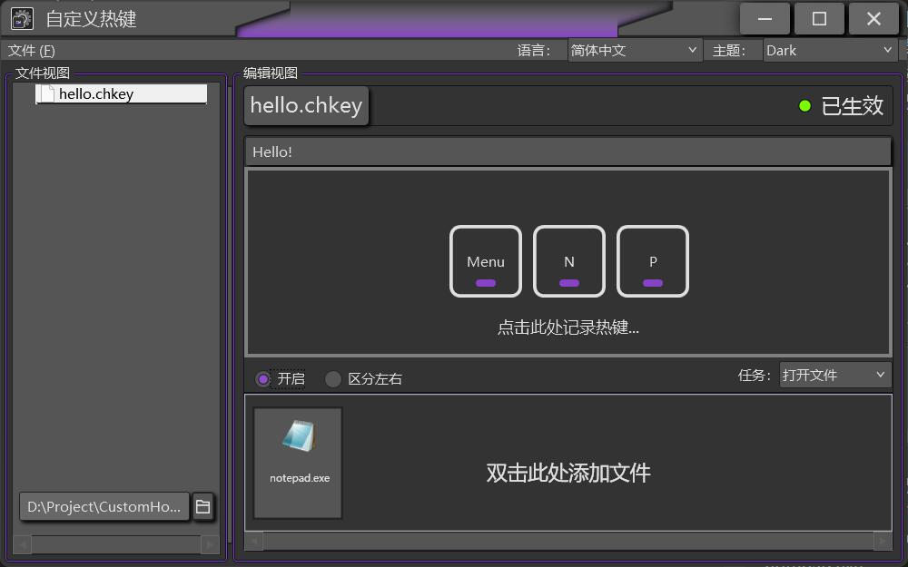

# 自定义热键 CustomHotKey

通过图形化界面(GUI)的形式直观的自定义热键，采用WPF&MVVM开发

## 主要特性

* 通过用户界面对热键进行增删改操作
* 通过json字符串的形式存储热键，方便迁移
* 内置深色浅色主题
* 程序主题色跟随系统主题色变化
* 多语言支持
* 程序免安装，即下即用

## 系统要求 

* windows 7 SP1 (需安装.net4.8)
* windows 8.1 (需安装.net4.8)
* windows 10
* windows 11

## 安装步骤

1. 前往 [release](https://gitee.com/CC_Hello/custom-hot-key/releases) 页面 
2. 选择合适的版本进行下载

## 卸载步骤

1. 展开主界面`设置`下拉框，点击`卸载`即可卸载 

## 如何使用

### 熟悉界面

打开程序，会看到如下界面(紫色部分会跟随系统主题色变化)：


右上角是文件菜单，可以管理关于文件的操作：


左上角是设置下拉框，展开后可以设置语言、主题：


主界面右侧是文件视图，可以直观的操作文件


主界面左侧是编辑视图，可以直观的修改热键文件(`.chkey`)(而不用去编写json字符串)

### 使用案例

<div id="onp"></div>

#### 打开记事本

比如，我想实现一按下`Alt + N + P`组合键就自动打开记事本的操作，下面有详细的做法：

首先，要准备一个热键文件(`.chkey`后缀的文件)，你可以直接在程序生成的hello.chkey文件上进行更改，  
也可以在文件视图任意地方右键→新建→文件，或者从文件菜单里进行新建文件的操作：



然后，我点击了编辑视图中间的"点击此处记录热键"字样，同时按下了`Alt + N + P`，这样程序就会将这组热键记录到`.chkey`文件中。  
(如果你有严格的要求，想要按下左侧`Alt`键(而不是右侧`Alt`键)后按下`N + P`键，之后程序再响应你的操作，可以把记录热键区域左下方的"区分左右"开启)，


再然后，我要将记录热键区域右下方的"任务"下拉框选项选为`打开文件`，双击"双击此处添加文件"的字样，在对话框中选中`C:\Windows\`下的notepad.exe，  
最后一步，点击记录热键区域左下方挨着"区分左右"复选按钮的"开启"复选按钮(最好把记录热键区域上方的描述也改一下，根据个人喜好改什么都行)



完成！现在只需要同时按下`Alt + N + P`后，就可以看见记事本了！(这里提供另一种思路，也可以把任务下拉框的选项选为`运行命令`，然后点击左上角的`+`，在文本框内输入notepad，也可以达到同样的效果)

## 热键的json字符串
以下是上文<a href="#onp">打开记事本<a/>案例中热键的json字符串
```json
{
  "Description": "Hello!",  
  "Open": true,  
  "Keys": [
    164,
    78,
    80
  ],
  "DistinguishLR": false,  
  "CommandType": "OpenFile",  
  "Command": {  
    "Args": [
      "C:\\Windows\\notepad.exe"
    ]
  }
}
```

## 关于程序自动生成的文件
程序会自动生成两个文件夹，一个名为`Key`，另一个名为`Language`。  
* **Language文件夹**
    * `Language`文件夹用于存储语言文件，语言文件以JSON键值对的方式存储每一个键对应的文本，新的语言文件会自动在程序内的语言下拉框中进行显示。
* **Key文件夹**
    * `Key`文件夹是默认存储热键文件的地方，用户可以在程序内更改存储热键文件的文件夹位置，但是Key文件夹一直存在。

## 更多
程序内的大部分图标从 [RemixIcon](https://remixicon.cn/) 下载